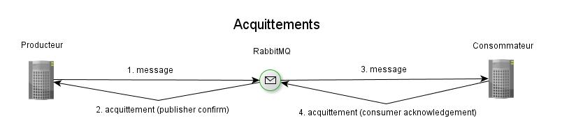

# Ne pas perdre de messages (acquittements)

## Le problème

Comment faire pour être sûr que tout message envoyé par le producteur est traité par le
consommateur, et donc qu'aucun message ne se perd dans la nature ?

## Discussion

Le fonctionnement réel d'un système de messagerie contient toujours des événements particuliers :
perte de connexion réseau, épuisement de la mémoire, blocage ou chute de RabbitMQ, trop grand
nombre de messages en attente, système de fichiers plein, tentative de connexion à un échange
ou une queue qui n'existe pas, etc. Ces événements sont à risques et constituent des causes
fréquentes de pertes de messages.

La solution s'appelle : les acquittements (acknowledgements).



### Acquittement de RabbitMQ au producteur (publisher confirms)

Ce mécanisme permet à la plateforme de confirmer au producteur la bonne prise en charge d’un message.
Dans le cas ou la plateforme émettrait un acquittement négatif, il est de la responsabilité du
producteur de réémettre son message.
Dans le cas des queues persistantes et des queues distribuées, l'acquittement est émis uniquement
lorsque l’écriture du message sur le support de stockage a été réalisée ou lorsque les réplicas ont
accepté le message.

Lors de l'émission de messages vers l'agent RabbitMQ, pour des raisons de performances il est
recommandé d'utiliser le mode d'acquittement asynchrone plutôt que d'activer le mode transactionnel.
En effet, les acquittements transactionnels, réputés plus sûrs, ralentissent énormément le système.

### Acquittement du consommateur à RabbitMQ (consumer acknowledgement)

Ce mécanisme d'acquittement permet aux consommateurs de messages de confirmer à la plateforme qu’un
message a été correctement reçu et traité.
Lorsque la plateforme reçoit un acquittement, le message correspondant est supprimé de la queue associée.
En cas d’acquittement négatif, le message est réinsérée dans la queue, à sa position originale si
possible ou proche de la tête de la queue.

Le mode d’acquittement peut être automatique ou manuel. En mode automatique, le message est acquitté immédiatement après son émission. En cas de défaillance du client avant que le message ne soit traité, celui-ci sera perdu. En mode manuel, le client doit explicitement acquitter le message lorsque celui-ci est correctement reçu et/ou traité.

Lors de la réception de messages :
- il est recommandé d'utiliser l'acquittement manuel lorsque la perte de message n'est pas acceptable.
- l'acquittement automatique peut être intéressant lorsqu'un fort débit est nécessaire. Mais attention : le producteur va pouvoir envoyer des messages avec un débit important, il faudra donc que les consommateurs soient en mesure de traiter tous les messages envoyés très rapidement.

### Notes

**RabbitMQ ne propose pas d'acquittement de bout en bout, c'est-à-dire d'acquittement du consommateur
au producteur**.
On n'a que des acquittements de RabbitMQ au producteur, et du consommateur à RabbitMQ.

Les éventuels messages de réponse du consommateur au producteur peuvent être vus comme des acquittements
métier.
Mais ils ne remplacent en aucune manière les acquittements plus techniques décrits ici.

Référence documentaire : [Acquittements RabbitMQ](https://www.rabbitmq.com/confirms.html#basics).

## Recommandations

### a) Mettre en place des acquittements de RabbitMQ au producteur (Publisher Confirms)

Le consommateur recevra un message d'erreur si son message n'a pas été enregistré par RabbitMQ.

Voici un exemple avec Java et Spring Boot.

Préalables : sur RabbitMQ on a créé les éléments suivants :
- une queue `queue1`
- un échange `exchange1` de type `direct`
- dans `exchange1`, une liaison (binding) vers `queue1` avec comme clef de routage `queue1`

Classe `Producer` :
```
public void run(String... args) {
    setupCallbacks();

    // envoi correct d'un message
    CorrelationData correlationData = new CorrelationData("Correlation for message 1");
    rabbitTemplate.convertAndSend(
            "exchange1",
            "queue1",
            "Message 1",
            message -> {
                log.info("Message envoye : [{}]", message);
                return message;
            },
            correlationData);

    // envoi d'un message dans une queue qui n'existe pas
    correlationData = new CorrelationData("Correlation for message 2");
    rabbitTemplate.convertAndSend(
            "exchange1",
            "queue1" + "queue1",
            "Message 2",
            message -> {
                // la trace suivante va s'afficher, mais il ne faut pas trop s'y fier...
                log.info("Message envoye : [{}]", message);
                return message;
            },
            correlationData);
}

private void setupCallbacks() {
    rabbitTemplate.setConfirmCallback((correlationData, ack, reason) -> {
        log.info("Confirmation : {} pour correlation [{}]",
                 ack ? "ack" : "nack", correlationData);
    });
    rabbitTemplate.setReturnsCallback((returned) -> {
        log.info("Retour pour message [{}] : replyCode = [{}], replyText = [{}], exchange = [{}], routing key = [{}]",
                 returned.getMessage(), returned.getReplyCode(), returned.getReplyText(),
                 returned.getExchange(), returned.getRoutingKey());
    });
}
```

Fichier de configuration `application.yml`:

```
spring:
  rabbitmq:
    publisher-confirm-type: correlated
    publisher-returns: true
...
```

Résultat (affiche une erreur `NO_ROUTE`) :

```
INFO  : Message envoye : [(Body:'Message 1' MessageProperties [headers={}, contentType=text/plain, contentEncoding=UTF-8, contentLength=9, deliveryMode=PERSISTENT, priority=0, deliveryTag=0])]
...
INFO  : Message envoye : [(Body:'Message 2' MessageProperties [headers={}, contentType=text/plain, contentEncoding=UTF-8, contentLength=9, deliveryMode=PERSISTENT, priority=0, deliveryTag=0])]
INFO  : Confirmation : ack pour correlation [CorrelationData [id=Correlation for message 1]]
INFO  : Retour pour message [(Body:'Message 2' MessageProperties [headers={spring_returned_message_correlation=Correlation for message 2}, contentType=text/plain, contentEncoding=UTF-8, contentLength=0, receivedDeliveryMode=PERSISTENT, priority=0, deliveryTag=0])] : replyCode = [312], replyText = [NO_ROUTE], exchange = [exchange1], routing key = [queue1queue1]
INFO  : Confirmation : ack pour correlation [CorrelationData [id=Correlation for message 2]]
```

Note interne à l'État de Genève :
le code est disponible dans le projet GitLab `rabbitmq-publisher-confirm`.

### b) Mettre en place des acquittements du consommateur à RabbitMQ (Consumer Acknowledgements)

RabbitMQ recevra un acquittement (ack ou nack) du consommateur.

Voici un exemple avec Java et Spring Boot. Le fonctionnement par défaut du `RabbitListener` de Spring
fait que les acquittements ack et nack sont fournis comme attendu.

Code :

```
@RabbitListener(queues = "queue1")
public void receiveMessage(String message) {
    log.info("Tapez \"1\" pour traiter le message sans erreur. Tapez \"2\" pour lancer une exception");
    String userChoice = new Scanner(System.in).nextLine();
    if (userChoice.equals("2")) {
        throw new IllegalStateException("Exception indiquant une erreur de traitement du message");
        // Spring RabbitMQ va envoyer un *** NACK *** à RabbitMQ et donc RabbitMQ va remettre le message
        // dans la queue et le resoumettre immédiatement
    } else {
        // Spring RabbitMQ va envoyer un *** ACK *** à RabbitMQ
    }
```

Note interne à l'État de Genève :
le code est disponible dans le projet GitLab `rabbitmq-consumer-ack`.

### c) Considérer la persistance des messages

En produisant des messages persistants, on peut gagner de la fiabilité, mais au détriment de l'efficacité.

Exemple en Java sans Spring :

```
AMQP.BasicProperties props = new AMQP.BasicProperties.Builder()
    .deliveryMode(2)    // message persistant
    .build();
}
channel.basicPublish(myExchange, myQueue, props, "Bonjour à tous !");
```

Exemple en Java avec Spring :

```
rabbitTemplate.convertAndSend(
    myExchange,
    myRoutingKey,
    "Bonjour à tous !",
    message -> {
        message.getMessageProperties().setDeliveryMode(PERSISTENT); // message persistant
        return message;
    }
);
```

### d) Ne pas considérer la transactionnalité

La transactionnalité de bout en bout, c'est-à-dire du producteur au consommateur, est un mirage qui
induit une nouvelle complexité, ralentit énormément le système et ne peut pas garantir la fiabilité
complète des échanges de messages.
Il faut la considérer comme un "anti-pattern" et centrer sur RabbitMQ la gestion de la fiabilité
des échanges de messages.
